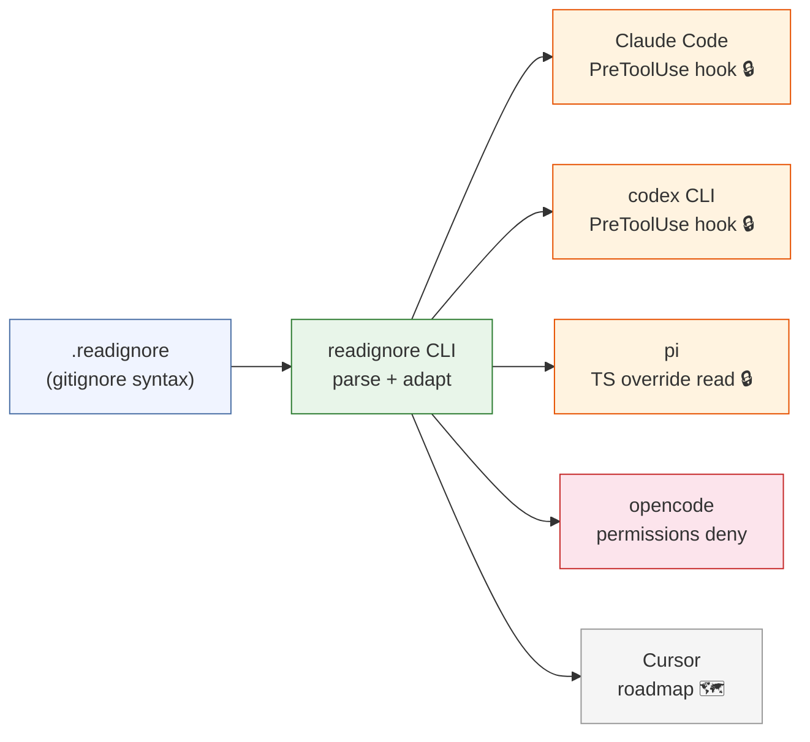

# readignore

**English** | [中文](README.zh-CN.md)

**`.gitignore` for AI coding agents — declare files your AI agent must not read.**

[](https://github.com/0xByteBard404/readignore/actions/workflows/ci.yml)
[](https://goreportcard.com/report/github.com/0xByteBard404/readignore)
[](https://github.com/0xByteBard404/readignore/blob/main/LICENSE)
[](https://go.dev/)

AI coding agents (Claude Code, Cursor, Codex, opencode, kilo code, …) can read
any file in your repo at runtime — **including secrets** like `.env`, `*.pem`,
`id_rsa`, `credentials.json`. Existing defenses have gaps:

- `.gitignore` only stops **git** from committing; the agent still reads the file.
- Claude Code's `permissions.deny: Read(.env)` only blocks the **Read** tool —
  agents bypass it with `Grep`, `Glob`, or `Bash` (`grep . .env` works).

**readignore** closes that gap with one `.readignore` (gitignore syntax) that
gets adapted into each agent's native defense mechanism — at the strongest level
that agent actually supports.

---

## How it works



You write one declarative `.readignore`. readignore translates it into the
**strongest available mechanism** for each target agent — and **honestly labels
the enforcement strength** of each, because the agents are not equivalent.

---

## Capability matrix

readignore adapts `.readignore` into each agent's strongest *real* mechanism.
Strength tiers are **honest**, not marketing:

| Agent | Strength | Mechanism | Status |
|---|---|---|---|
| **Claude Code** | **hard** | `PreToolUse` hook — blocks the tool call **before** it runs (Read, Grep, Glob, Bash). Programmatic interception at runtime. | ✅ shipped |
| **codex CLI** | **hard** | `.codex/hooks.json` Claude-style `PreToolUse` hook (bash, calls `readignore match`). Same runtime-deny mechanism as Claude Code; requires hook trust on first run. See [codex note](#codex-platform-note) below. | ✅ shipped |
| **pi** | **hard** | `.pi/extensions/readignore.ts` TypeScript extension that **overrides** the built-in `read` tool — calls `readignore match` and returns `Access denied` for matched paths before the file is read. Auto-loaded at startup. | ✅ shipped |
| **opencode** | **config** | `permission.read` deny/allow globs in `opencode.json`; enforced when opencode loads config. | ✅ shipped |
| **Cursor** | soft | `.cursor/rules` natural-language advisory (model may comply). | 🗺 roadmap |
| **kilo code** | — | mechanism TBD. | 🗺 roadmap |

### What "strength" means

- **hard** — code runs *before* the tool executes (or before its output reaches
  the model) and can deny the call. Three flavors today, all genuinely enforced
  at runtime:
  - **Claude Code / codex** — a `PreToolUse` hook script returns
    `permissionDecision: "deny"` and the tool **never runs**.
  - **pi** — a TypeScript extension registered with the same name as the
    built-in `read` tool *overrides* it; matched paths return `Access denied`
    and the file is never read.
- **config** — readignore writes a native deny config (e.g. opencode's
  `permission.read`). Enforcement depends on the agent faithfully loading it.
  opencode's programmatic `permission.ask` hook is currently a no-op at runtime
  ([opencode #7006](https://github.com/anomalyco/opencode/issues/7006)), so we
  cannot reach `hard` there yet.
- **soft** — a natural-language rule the model is *asked* to honor. No
  enforcement. Future adapters for Cursor-style tools land here.

readignore does **not** claim cross-agent equivalence. It adapts to whatever
each agent can actually enforce.

---

## Quickstart

```bash
# 1. Install
go install github.com/0xByteBard404/readignore/cmd/readignore@latest

# 2. In your repo:
cd your-repo
readignore init            # generates .readignore with common secret patterns

# 3. Edit .readignore to match your project, then install for your agent(s):
readignore install claude-code          # single agent
readignore install codex                # codex CLI (Claude-style PreToolUse hook)
readignore install pi                   # pi (.pi/extensions/ TS override, auto-loaded)
# or install for every agent detected in this repo:
readignore install --all
```

`init` refuses to overwrite an existing `.readignore` unless you pass `--force`.

---

## Commands

```bash
# Generate a .readignore template (with .env, *.pem, id_rsa, .aws/, … patterns)
readignore init [--force]

# List registered adapters, their strength, and detection status in this repo
readignore adapters

# Dry-run: parse .readignore and print what an adapter would generate (stdout)
readignore generate claude-code
readignore generate codex
readignore generate pi
readignore generate opencode

# Write an adapter's output to disk
readignore install claude-code          # one adapter
readignore install --all                # all adapters detected here
readignore install claude-code --force  # overwrite existing files

# Validate .readignore syntax and report each adapter's install status
readignore check

# Check if a path is denied by .readignore (exit 0=allow, 1=deny)
# This is what hooks call at runtime — you can use it directly for debugging
readignore match .env
```

If a target file already exists, `install` **skips it** (and tells you to merge
manually) unless you pass `--force`. This avoids clobbering your existing
`.claude/settings.json` or `opencode.json`.

---

## `.readignore` syntax

100% gitignore-compatible. Zero learning curve:

```gitignore
# readignore — files this repo's AI agent must not read

# Secrets & keys
.env
.env.*
!.env.example            # ! un-ignores (negation): allow the template through
*.pem
*.key

# SSH / cloud credentials
**/id_rsa
.aws/
.gcp/

# Sensitive directories
secrets/
credentials.json

# Trailing / anchors to directories only
build/
```

Supported: `*`, `**`, `?`, `[abc]` character classes, `!` negation
(last-match-wins, just like gitignore), trailing `/` for directory anchoring,
`#` comments. See the [gitignore spec](https://git-scm.com/docs/gitignore).

---

## What gets generated

### Claude Code (`readignore install claude-code`)

Two files under `.claude/`:

```
.claude/hooks/readignore.sh   (0755)  # extracts target path, calls `readignore match`
.claude/settings.json                 # registers the hook on PreToolUse
```

The hook fires on `Read | Grep | Glob | Bash`, calls `readignore match <path>`
(the **go-git authority** for gitignore matching), and **denies before
execution** when the path is matched (`exit 1` = deny). Claude Code's settings
watcher picks up the change live — **no restart needed**.

**Editing `.readignore` takes effect immediately** — the hook re-reads
`cwd/.readignore` on every call via `readignore match`, so you never need to
re-run `install` after editing rules. Same edit-and-go experience as
`.gitignore`.

### opencode (`readignore install opencode`)

A single `opencode.json` with `permission.read` deny/allow globs:

```json
{
  "$schema": "https://opencode.ai/config.json",
  "permission": {
    "read": {
      ".env": "deny",
      ".env.*": "deny",
      ".env.example": "allow"
    }
  }
}
```

opencode reads this at startup.

> **Negation caveat (opencode only):** opencode's glob engine has no gitignore
> order/negation semantics. readignore approximates `!` negation via "more
> specific allow glob beats broader deny glob" — correct for common cases
> (`*.env` deny + `!a.env` allow → `a.env` allowed), but **complex negation
> chains may diverge** from gitignore. If you depend on intricate negation,
> prefer the Claude Code adapter (full gitignore semantics). See
> [opencode adapter docs](./internal/adapter/opencode/opencode.go).

### codex CLI (`readignore install codex`)

Two files under `.codex/`, mirroring the Claude Code layout:

```
.codex/hooks/readignore.sh   (0755)  # extracts target path, calls `readignore match`
.codex/hooks.json                    # registers the hook (Claude-style PreToolUse)
```

codex's hook protocol is [Claude-style](https://github.com/openai/codex)
(`PreToolUse` + `permissionDecision: "deny"`), so the same bash hook runs — it
calls `readignore match` (go-git authority) and denies before the tool
executes. Like Claude Code, **editing `.readignore` takes effect immediately**
(no re-install needed).

> **Hook trust:** codex gates project-level hooks behind a trust prompt. The
> first time a project hook runs you'll be asked to confirm trust; pass
> `--dangerously-bypass-hook-trust` to skip the check (e.g. in CI).

#### codex platform note — Bash-only hook trigger

Unlike Claude Code, **codex has no standalone `Read` / `Grep` / `Glob` tools**.
The codex agent reads files exclusively via **shell commands** (`cat .env`,
`head -n 50 file`, `grep pattern file`). Consequently the `PreToolUse` hook
fires *natively* only on `tool_name="Bash"` (with the target path appearing
inside `tool_input.command`), and readignore's matcher extracts the path from
that `command` string.

The `matcher: "Read|Grep|Glob|Bash"` in `hooks.json` is deliberate, not a bug:

- it keeps the codex adapter **symmetric** with the Claude Code adapter (same
  shared bash hook, both calling `readignore match`);
- it covers users who install **MCP tools** exposing `Read`/`Grep`/`Glob` into
  codex — those MCP tools would also be intercepted.

But for codex's **native** tool set, only the `Bash` arm ever fires. A native
"read this file" call is always a Bash command, which the hook does intercept.

### pi (`readignore install pi`)

A single TypeScript extension:

```
.pi/extensions/readignore.ts   (0644)  # overrides pi's built-in `read` tool
```

pi [auto-loads `.pi/extensions/*.ts`](https://github.com/earendil-works/pi-coding-agent)
at startup. The extension registers a tool named `read` — the same name as pi's
built-in — which **overrides** it: it calls `readignore match <path>` (go-git
authority) and matched paths return `Access denied` before the file is ever
read; everything else delegates to a normal read. No pi types are imported, so
the file type-checks in isolation. As with the hook adapters, **editing
`.readignore` takes effect immediately**.

---

## Installation

**npm (recommended — no Go needed):**

```bash
npm i -g readignore      # or: npx readignore
```

The npm wrapper's `postinstall` downloads the right Go binary for your platform
from [GitHub Releases](https://github.com/0xByteBard404/readignore/releases).

**`go install` (if you have Go 1.25+):**

```bash
go install github.com/0xByteBard404/readignore/cmd/readignore@latest
```

**Binary download:** grab the archive for your platform from
[Releases](https://github.com/0xByteBard404/readignore/releases), extract, and
put `readignore` on your PATH.

**`curl | sh` one-liner (Linux / macOS, no Go or npm needed):**

```bash
curl -fsSL https://raw.githubusercontent.com/0xByteBard404/readignore/main/install.sh | sh
```

The script detects your OS/arch, fetches the matching binary + `checksums.txt`
from the latest release, verifies the SHA256, and installs `readignore` to
`/usr/local/bin` (falling back to `~/.local/bin`, with a PATH hint if needed).
Windows users: use npm, Scoop, or the `.zip` from Releases.

**Homebrew:**

```bash
brew tap 0xByteBard404/tap
brew install readignore
```

(Requires the `0xByteBard404/homebrew-tap` repo — available once the first v0.3
release publishes.)

**Coming soon:** Scoop (Windows).

---

## Why not just `.gitignore` or `permissions.deny`?

| Approach | Fails to block |
|---|---|
| `.gitignore` | Agent reads file at runtime (gitignore only stops commits). |
| Claude Code `permissions.deny: Read(.env)` | `Grep`, `Glob`, `Bash` (`grep . .env`) bypass it. |
| Per-agent manual config | Duplicated effort across 5+ agents; drifts out of sync. |

readignore is **one declaration, adapted per agent**, at each agent's strongest
enforcement point.

---

## Project status

v0.3.0 — three **hard** adapters (Claude Code, codex CLI, pi) + one **config**
adapter (opencode). All hooks now call `readignore match` (go-git authority),
so **editing `.readignore` takes effect immediately** — no re-install needed.
Install via npm, `curl | sh`, or Homebrew. Cursor and kilo code adapters are
on the roadmap.

See [CHANGELOG.md](./CHANGELOG.md) for the version history.

---

## Contributing

Contributions welcome — especially **new adapters** (Cursor rules, kilo code).
Each adapter implements a small [`Adapter`
interface](./internal/adapter/adapter.go) and self-registers in `init()`.

See [CONTRIBUTING.md](./CONTRIBUTING.md) and [CODE_OF_CONDUCT.md](./CODE_OF_CONDUCT.md).
Please open an issue first to discuss adapter design before building.

---

## License

[MIT](./LICENSE) © 2026 0xByteBard404
