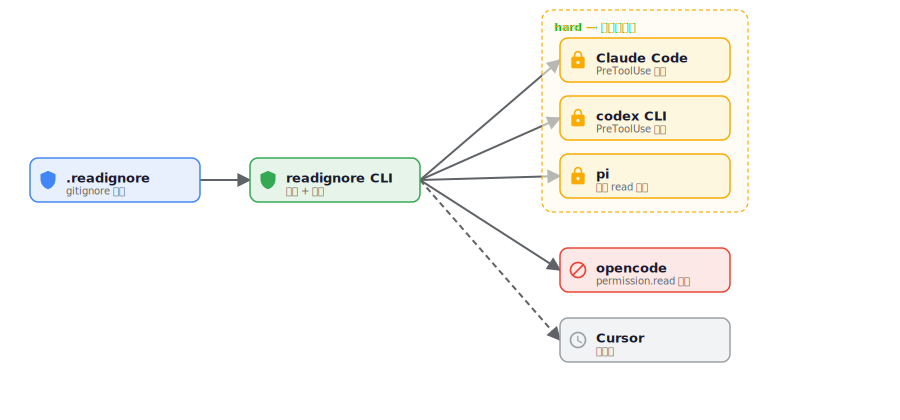

# readignore

<picture>
  <source media="(prefers-color-scheme: dark)" srcset="docs/images/logo/readignore-hero-dark.svg">
  
</picture>

[English](README.md) | **中文**

**AI 编程智能体的 `.gitignore` —— 声明你的 AI 智能体禁止读取的文件。**

[](https://github.com/0xByteBard404/readignore/actions/workflows/ci.yml)
[](https://goreportcard.com/report/github.com/0xByteBard404/readignore)
[](https://github.com/0xByteBard404/readignore/blob/main/LICENSE)
[](https://go.dev/)

> **TL;DR** — `npm i -g readignore && readignore init && readignore install --all`

AI 编程智能体（Claude Code、Cursor、Codex、opencode、kilo code ……）在运行时可以
读取你仓库里的**任何**文件——**包括密钥**，如 `.env`、`*.pem`、`id_rsa`、
`credentials.json`。现有防护方案各有缺口：

- `.gitignore` 只阻止 **git** 提交；智能体仍然能把文件读出来。
- Claude Code 的 `permissions.deny: Read(.env)` 只挡住 **Read** 工具——智能体可以用
  `Grep`、`Glob` 或 `Bash` 绕过（`grep . .env` 照样能跑）。

**readignore** 用一个 `.readignore`（gitignore 语法）补上这个缺口，把它适配成每个
智能体的原生防御机制——并且是各智能体**真正支持的最高强度**。

---

## 工作原理

<picture>
  <source media="(prefers-color-scheme: dark)" srcset="docs/images/how-it-works-zh-dark.svg">
  
</picture>

你只写一份声明式的 `.readignore`。readignore 把它翻译成每个目标智能体**当前可用的
最强机制**——并**诚实标注**每一项的实际强制强度，因为各智能体并不等价。

---

## 能力矩阵

readignore 把 `.readignore` 适配成每个智能体**真正可用**的最强机制。强度分级是
**诚实**的，不是营销话术：

| 智能体 | 强度 | 机制 | 状态 |
|---|---|---|---|
| **Claude Code** | **hard** | `PreToolUse` 钩子——在工具调用**执行前**拦截（Read、Grep、Glob、Bash）。运行时程序化拦截。 | ✅ 已发布 |
| **codex CLI** | **hard** | `.codex/hooks.json`，Claude-style 的 `PreToolUse` 钩子（bash，调 `readignore match`）。与 Claude Code 同一套运行时拦截机制；首次运行需通过钩子信任提示。详见下方 [codex 平台说明](#codex-平台说明仅-bash-路径触发)。 | ✅ 已发布 |
| **pi** | **hard** | `.pi/extensions/readignore.ts` TypeScript 扩展**覆写**内置 `read` 工具——调 `readignore match`，匹配的路径在读取前返回 `Access denied`。启动时自动加载。 | ✅ 已发布 |
| **opencode** | **config** | `opencode.json` 里的 `permission.read` deny/allow glob；opencode 加载配置时生效。 | ✅ 已发布 |
| **Cursor** | soft | `.cursor/rules` 自然语言建议（模型可能遵守）。 | 🗺 路线图 |
| **kilo code** | — | 机制待定。 | 🗺 路线图 |

### “强度”的含义

- **hard** —— 代码在工具**执行前**（或在其输出到达模型前）运行，可以拒绝这次调用。
  目前有三种形态，都是运行时真正强制执行：
  - **Claude Code / codex** —— 一个 `PreToolUse` 钩子脚本返回
    `permissionDecision: "deny"`，工具**根本不会执行**。
  - **pi** —— 一个 TypeScript 扩展，以与内置 `read` 工具**同名**注册从而*覆写*它；
    匹配的路径返回 `Access denied`，文件根本不会被读取。
- **config** —— readignore 写出原生 deny 配置（如 opencode 的
  `permission.read`）。能否生效取决于智能体是否忠实地加载它。opencode 的
  `permission.ask` 程序化钩子目前在运行时是空操作
  （[opencode #7006](https://github.com/anomalyco/opencode/issues/7006)），所以我们暂时
  在 opencode 上还达不到 `hard`。
- **soft** —— 一条自然语言规则，*请求*模型遵守。无强制力。Cursor 风格工具的未来适配器
  会落在这里。

readignore **不**声称跨智能体等价。它只是适配到每个智能体实际能强制执行的机制。

---

## 快速开始

```bash
# 1. 安装（npm，无需 Go；其他方式见下方「安装」）
npm i -g readignore

# 2. 在你的仓库里：
cd your-repo
readignore init            # 生成 .readignore，内置常见密钥模式

# 3. 编辑 .readignore 使之匹配你的项目，然后为你使用的智能体安装：
readignore install claude-code          # 单个智能体
readignore install codex                # codex CLI（Claude-style PreToolUse 钩子）
readignore install pi                   # pi（.pi/extensions/ TS 覆写，自动加载）
# 或为本仓库检测到的全部智能体安装：
readignore install --all
```

`init` 拒绝覆盖已有的 `.readignore`，除非你传 `--force`。

---

## 命令

```bash
# 生成 .readignore 模板（含 .env、*.pem、id_rsa、.aws/ …… 等模式）
readignore init [--force]

# 列出已注册的适配器、其强度，以及在本仓库中的检测状态
readignore adapters

# 干跑：解析 .readignore 并打印某个适配器将要生成的内容（输出到 stdout）
readignore generate claude-code
readignore generate codex
readignore generate pi
readignore generate opencode

# 把某个适配器的产物写入磁盘
readignore install claude-code          # 单个适配器
readignore install --all                # 本仓库检测到的全部适配器
readignore install claude-code --force  # 覆盖已有文件

# 刷新某个适配器产物到当前 readignore 版本（= install --force）
readignore update                       # 全部检测到的适配器（默认 = --all）
readignore update claude-code           # 单个适配器

# 移除某个适配器的产物（install 的逆操作）
readignore uninstall claude-code            # 单个适配器
readignore uninstall --all                  # 本仓库检测到的全部适配器
readignore uninstall claude-code --dry-run  # 仅预览，不真删

# 校验 .readignore 语法并报告每个适配器的安装状态
readignore check

# 检查某路径是否被 .readignore 拦截（exit 0=放行, 1=拦截）
# 这正是钩子在运行时调用的命令——你也可以直接用它调试
readignore match .env
```

如果目标文件已存在，`install` **会跳过**（并提示你手动合并），除非你传
`--force`。这样避免覆盖你已有的 `.claude/settings.json` 或 `opencode.json`。

---

## `.readignore` 语法

100% 兼容 gitignore，零学习成本：

```gitignore
# readignore —— 本仓库 AI 智能体禁止读取的文件

# 密钥
.env
.env.*
!.env.example            # ! 取反（negation）：放行模板文件
*.pem
*.key

# SSH / 云凭证
**/id_rsa
.aws/
.gcp/

# 敏感目录
secrets/
credentials.json

# 末尾的 / 仅锚定目录
build/
```

支持：`*`、`**`、`?`、`[abc]` 字符类、`!` 取反（最后匹配优先，与 gitignore 一致）、
末尾 `/` 目录锚定、`#` 注释。详见
[gitignore 规范](https://git-scm.com/docs/gitignore)。

---

## 各适配器生成什么

### Claude Code（`readignore install claude-code`）

在 `.claude/` 下生成两个文件：

```
.claude/hooks/readignore.sh   (0755)  # 提取目标路径，调用 `readignore match`
.claude/settings.json                 # 在 PreToolUse 上注册钩子
```

钩子在 `Read | Grep | Glob | Bash` 时触发，调用 `readignore match <path>`
（go-git 权威匹配），路径命中时（`exit 1` = deny）**在执行前拒绝**。
Claude Code 的 settings 监听器会实时感知这一变更——**无需重启**。

**改 `.readignore` 立即生效**——钩子每次调用都通过 `readignore match` 重新读
`cwd/.readignore`，编辑规则后**无需重新 install**。与 `.gitignore` 一样改完即用。

### opencode（`readignore install opencode`）

单个 `opencode.json`，含 `permission.read` 的 deny/allow glob：

```json
{
  "$schema": "https://opencode.ai/config.json",
  "permission": {
    "read": {
      ".env": "deny",
      ".env.*": "deny",
      ".env.example": "allow"
    }
  }
}
```

opencode 在启动时读取它。

> **取反注意事项（仅 opencode）：** opencode 的 glob 引擎没有 gitignore 的顺序/取反
> 语义。readignore 通过“更具体的 allow glob 击败更宽泛的 deny glob”来近似 `!`
> 取反——常见场景正确（`*.env` deny + `!a.env` allow → `a.env` 放行），但**复杂的
> 取反链可能与 gitignore 不一致**。如果你依赖复杂的取反，优先用 Claude Code 适配器
> （完整 gitignore 语义）。详见
> [opencode 适配器文档](./internal/adapter/opencode/opencode.go)。

### codex CLI（`readignore install codex`）

在 `.codex/` 下生成两个文件，与 Claude Code 布局一致：

```
.codex/hooks/readignore.sh   (0755)  # 提取目标路径，调用 `readignore match`
.codex/hooks.json                    # 注册钩子（Claude-style PreToolUse）
```

codex 的钩子协议是
[Claude-style](https://github.com/openai/codex)
（`PreToolUse` + `permissionDecision: "deny"`），因此运行同一套 bash 钩子——它调用
`readignore match`（go-git 权威）并在工具执行前拒绝。与 Claude Code 一样，
**改 `.readignore` 立即生效**（无需重新 install）。

> **钩子信任：** codex 对项目级钩子设有信任提示。项目钩子首次运行时会要求你确认信任；
> 传 `--dangerously-bypass-hook-trust` 可跳过该检查（例如在 CI 中）。

#### codex 平台说明：仅 Bash 路径触发

与 Claude Code 不同，**codex 没有独立的 `Read` / `Grep` / `Glob` 工具**。codex
agent 读文件一律走 **shell 命令**（`cat .env`、`head -n 50 file`、`grep pattern
file`）。因此 `PreToolUse` 钩子**原生只在 `tool_name="Bash"`** 时触发（目标路径
出现在 `tool_input.command` 里），readignore 的匹配器从该 `command` 字符串中抽取
路径参与匹配。

`hooks.json` 里的 `matcher: "Read|Grep|Glob|Bash"` 是有意为之，不是 bug：

- 让 codex 适配器与 Claude Code 适配器**对称**（共用同一套 bash 钩子，都调 `readignore match`）；
- 覆盖用户在 codex 里装的 **MCP 工具**——若 MCP 暴露了 `Read`/`Grep`/`Glob` 同名
  工具，钩子同样会拦。

但就 codex 的**原生**工具集而言，只有 `Bash` 那一支会真正命中。原生「读文件」调用
始终是 Bash 命令，而这条路径钩子确实会拦截。

### pi（`readignore install pi`）

单个 TypeScript 扩展：

```
.pi/extensions/readignore.ts   (0644)  # 覆写 pi 内置 `read` 工具
```

pi 在启动时
[自动加载 `.pi/extensions/*.ts`](https://github.com/earendil-works/pi-coding-agent)。
该扩展注册一个名为 `read` 的工具——与 pi 内置工具同名——从而**覆写**它：它调用
`readignore match <path>`（go-git 权威），匹配的路径在文件被读取前返回
`Access denied`；其余情况委托给正常读取。不引入任何 pi 类型，因此文件可独立通过类型检查。
与钩子适配器一样，**改 `.readignore` 立即生效**。

---

## 安装

**npm（推荐，无需 Go 环境）：**

```bash
npm i -g readignore      # 或：npx readignore
```

npm 壳包的 `postinstall` 会按你的平台从 [GitHub Releases](https://github.com/0xByteBard404/readignore/releases) 下载对应的 Go 二进制。

**`go install`（有 Go 1.25+ 环境）：**

```bash
go install github.com/0xByteBard404/readignore/cmd/readignore@latest
```

**二进制下载：** 从 [Releases](https://github.com/0xByteBard404/readignore/releases) 下载你平台的压缩包，解压后把 `readignore` 放到 PATH。

**`curl | sh` 一键脚本（Linux / macOS，无需 Go 或 npm）：**

```bash
curl -fsSL https://raw.githubusercontent.com/0xByteBard404/readignore/main/install.sh | sh
```

脚本会自动检测 OS/架构，从最新 release 下载对应二进制 + `checksums.txt`，
校验 SHA256 后安装到 `/usr/local/bin`（无写权限时回退到 `~/.local/bin` 并提示加 PATH）。
Windows 用户请用 npm、Scoop 或从 Releases 下载 `.zip`。

**Homebrew：**

```bash
brew tap 0xByteBard404/tap
brew install readignore
```

（需 `0xByteBard404/homebrew-tap` 仓库。）

**即将推出：** Scoop（Windows）。

---

## 为什么不直接用 `.gitignore` 或 `permissions.deny`？

| 方案 | 漏掉什么 |
|---|---|
| `.gitignore` | 智能体运行时仍会读取文件（gitignore 只挡提交）。 |
| Claude Code `permissions.deny: Read(.env)` | `Grep`、`Glob`、`Bash`（`grep . .env`）可绕过。 |
| 每个智能体单独手配 | 在 5+ 个智能体间重复劳动；容易失同步。 |

readignore 是**一份声明，按智能体适配**，落在每个智能体能做到的最强强制点。

---

## 项目状态

v0.3.0 —— 三个 **hard** 适配器（Claude Code、codex CLI、pi）+ 一个 **config**
适配器（opencode）。所有钩子现统一调 `readignore match`（go-git 权威），因此
**改 `.readignore` 立即生效**——无需重新 install。可通过 npm、`curl | sh` 或 Homebrew
安装。Cursor 和 kilo code 适配器在路线图上。

版本历史见 [CHANGELOG.md](./CHANGELOG.md)。

---

## 贡献

欢迎贡献——尤其是**新适配器**（Cursor rules、kilo code）。每个适配器实现一个小的
[`Adapter` 接口](./internal/adapter/adapter.go)，并在 `init()` 中自注册。

参见 [CONTRIBUTING.md](./CONTRIBUTING.md) 和
[CODE_OF_CONDUCT.md](./CODE_OF_CONDUCT.md)。在动手构建适配器之前，请先开 issue 讨论设计。

---

## 许可证

[MIT](./LICENSE) © 2026 0xByteBard404
